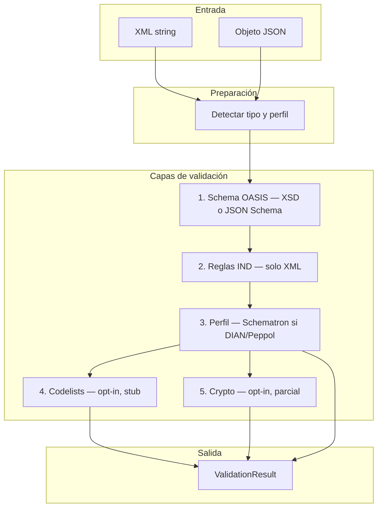

# Qué es y cómo funciona

Guía para entender **@prodaric/ubl-validator** sin asumir que ya conoces UBL, Schematron ni la facturación electrónica colombiana.

## Resumen en 30 segundos

**@prodaric/ubl-validator** es una librería de Node.js (con soporte browser y Angular) que comprueba si un documento **UBL 2.1** — una factura, nota crédito, orden de compra, etc. — está bien formado según el estándar internacional **OASIS** y, si aplica, según reglas adicionales de un **perfil** como **DIAN** (Colombia) o **Peppol** (Europa).

Le pasas XML o JSON. Te devuelve `valid: true/false`, una lista de errores y avisos, y qué capas se ejecutaron.

```ts
import { validate } from "@prodaric/ubl-validator";

const result = await validate(facturaXml);
console.log(result.valid);                    // ¿pasa todas las comprobaciones?
console.log(result.meta?.profileDetected);   // p. ej. "dian-fe-1.9"
console.log(result.errors);                   // qué falló y dónde
```

> **Estado actual:** versión alpha (`2.1.0-alpha.x`). Cubre la estructura y reglas base; las reglas oficiales completas de DIAN/Peppol y la firma digital aún están **parcialmente** implementadas. Ver [roadmap.md](./roadmap.md).

---

## Contexto: qué es UBL

**UBL** (*Universal Business Language*) es un estándar de OASIS para intercambiar documentos comerciales en XML (y, desde UBL 2.1, también en JSON). Un mismo modelo describe facturas, notas crédito, órdenes, despachos, etc.

En la práctica verás UBL cuando:

| Contexto | Ejemplo |
|----------|---------|
| Facturación electrónica Colombia | Factura XML con extensiones `sts:*` de la DIAN |
| Peppol / EN 16931 (UE) | Factura BIS Billing con `CustomizationID` Peppol |
| Integración B2B genérica | XML UBL sin perfil nacional concreto |

Un documento UBL tiene:

- **Tipo de documento** — raíz XML: `Invoice`, `CreditNote`, `DespatchAdvice`, … (65 tipos en UBL 2.1).
- **Esquema OASIS** — XSD (XML) o JSON Schema model (JSON): define qué elementos y atributos existen y sus tipos.
- **Perfil opcional** — reglas extra encima de OASIS (DIAN, Peppol, …): campos obligatorios, códigos, CUFE, etc.

Este validador implementa esa separación en **capas** que puedes activar o omitir.

---

## Qué hace este paquete

| Sí hace | No hace (hoy o nunca) |
|---------|------------------------|
| Validar XML contra XSD OASIS UBL 2.1 | Enviar documentos a la DIAN ni a Peppol |
| Validar JSON contra el modelo OASIS | Sustituir el software de facturación de un ERP |
| Aplicar reglas IND estructurales (encoding, elementos vacíos, `languageID`, …) | Garantizar aceptación tributaria en producción (alpha) |
| Detectar perfil DIAN / Peppol / BII / OASIS | Ejecutar Schematron completo ISO con Saxon |
| Ejecutar reglas Schematron **mínimas** empaquetadas (Node) | Validar XSD de extensión DIAN (`sts:*`) — pendiente |
| Verificación cripto **opt-in** (CUFE parcial) | Firmar documentos ni generar CUFE oficiales |
| CLI `ubl-validate` y API programática | Traducir mensajes de error (`locale` sin efecto aún) |

Piensa en él como un **lint estructural + perfil ligero** para integradores, no como un certificador oficial.

---

## Cómo funciona por dentro

### Vista general



### Paso a paso

1. **Parse y detección** — ¿Es XML o JSON? ¿Qué tipo UBL es (`Invoice`, …)? ¿Hay señales de DIAN, Peppol u otro perfil?
2. **SchemaStage (siempre)** — Comprueba la forma del documento contra OASIS. En XML usa XSD; en JSON usa Ajv + JSON Schema model.
3. **IndRulesStage (XML, siempre)** — Reglas estructurales del estándar UBL 2.1 que el XSD no cubre (IND2–IND8). Detalle en [conformance-ubl-2.1.md](./conformance-ubl-2.1.md).
4. **ProfileStage (XML, si hay perfil)** — Si detecta DIAN o Peppol (o lo fuerzas con `--profile`), ejecuta reglas Schematron empaquetadas. Con `{ profile: "none" }` se salta.
5. **CodeListStage / CryptoStage (opt-in)** — Solo si pasas `{ codelist: true }` o `{ crypto: true }`. Hoy son limitados; ver [roadmap.md](./roadmap.md).

Orden fijo y agregación de resultados: [pipeline.md](./pipeline.md).

### Ejemplo mental: factura DIAN

Imagina un XML de factura electrónica colombiana con `sts:DianExtensions`:

```
Tu app genera XML
       ↓
validate(xml)  // profile: "auto" (default)
       ↓
┌──────────────────────────────────────┐
│ Detecta: Invoice + perfil dian-fe-1.9 │
├──────────────────────────────────────┤
│ schema  → ¿cumple XSD UBL Invoice?   │  ← errores cvc-* si falta un campo
│ ind     → ¿encoding, sin tags vacíos?│  ← IND5 si hay <Tag></Tag> vacío
│ profile → reglas .sch DIAN mínimas   │  ← asserts Schematron empaquetados
└──────────────────────────────────────┘
       ↓
{ valid, errors, warnings, stages, meta }
```

Si solo te importa que el XML sea UBL válido antes de tus propias reglas de negocio:

```ts
await validate(xml, { profile: "none" });
```

---

## XML vs JSON

| | XML | JSON (model OASIS) |
|---|-----|---------------------|
| **Uso típico** | Facturación electrónica, intercambio B2B | APIs, formularios, SPA |
| **SchemaStage** | XSD OASIS | JSON Schema + Ajv |
| **Reglas IND** | Sí | No (IND es sobre sintaxis XML) |
| **ProfileStage (Schematron)** | Sí, si hay perfil | No — aviso `PROFILE_JSON` |
| **Detección de perfil** | Sí | Sí (por cabeceras del modelo) |
| **Browser / Angular** | Limitado (sin Schematron) | Sí, vía subpath `/browser` o `/angular` |

Para JSON debes indicar el tipo si no se infiere:

```ts
await validate(invoiceObject, {
  format: "json",
  documentType: "Invoice",
});
```

---

## Perfiles: OASIS, DIAN, Peppol

Un **perfil** es un conjunto de reglas **adicionales** al XSD base.

| Perfil | Cuándo se activa | Qué añade hoy |
|--------|------------------|---------------|
| `oasis-ubl-2.1` | Sin señales DIAN/Peppol | Solo capas 1–2 (schema + IND) |
| `dian-fe-1.9` | `sts:DianExtensions`, `ProfileID` con "DIAN", etc. | Schematron mínimo + refs a XSD ext. (no validado aún) |
| `peppol-bis-billing-3` | `CustomizationID` / `ProfileID` Peppol o EN16931 | Schematron mínimo |
| `bii-legacy` | URN CEN BII | Detección; sin Schematron empaquetado |

Detección automática (prioridad): **DIAN → Peppol → BII → OASIS**. Señales y overrides: [profiles.md](./profiles.md).

---

## Cómo leer el resultado

```ts
interface ValidationResult {
  valid: boolean;           // false si hay al menos un error (severity: "error")
  documentType: string;     // "Invoice", etc.
  format: "xml" | "json";
  errors: ValidationIssue[];
  warnings: ValidationIssue[];  // no invalidan solas
  stages?: {                // resumen por capa ejecutada
    schema?: { valid: boolean; errorCount: number; warningCount: number };
    ind?: { ... };
    profile?: { ... };
  };
  meta?: {
    profileDetected?: string;       // perfil inferido
    profileConfidence?: "certain" | "likely" | "fallback";
    profileSignals?: string[];      // p. ej. ["sts:DianExtensions"]
  };
}
```

Cada issue incluye `code`, `message`, `stage`, `source`, y opcionalmente `path` / línea. Catálogo de códigos: [errors.md](./errors.md).

**Interpretación rápida:**

- `valid: false` + `stage: "schema"` → el documento no cumple el XSD/JSON Schema OASIS (estructura base rota).
- `valid: false` + `stage: "ind"` → XML mal formado según reglas UBL (p. ej. elemento vacío IND5).
- `valid: false` + `stage: "profile"` → falló una regla Schematron del perfil.
- `valid: true` con `warnings` → pasa, pero revisa avisos (UTF-8, stub codelist, etc.).

Con `{ failFast: true }` el pipeline se detiene en la primera capa con errores.

---

## Formas de usarlo

### 1. API en Node.js (integración backend)

```ts
import { validate } from "@prodaric/ubl-validator";

const result = await validate(xmlBuffer.toString("utf8"));
if (!result.valid) {
  return res.status(422).json({ errors: result.errors });
}
```

Precarga tipos frecuentes para evitar cold-start: `preloadDocumentTypes(["Invoice"])`. Ver [api.md](./api.md).

### 2. CLI (pruebas manuales y CI)

```bash
npm install @prodaric/ubl-validator@alpha
npx ubl-validate factura.xml
npx ubl-validate factura.xml --profile none --json-report
```

Salida: `0` válido, `1` inválido, `2` error de uso. Ver [getting-started.md](./getting-started.md).

### 3. Browser (validación OASIS en el cliente)

Solo schema (+ detección de perfil). Sin Schematron ni crypto.

```ts
import { configureBrowserSchemas, validate } from "@prodaric/ubl-validator/browser";
configureBrowserSchemas("/assets/ubl-schemas/");
```

### 4. Angular Forms (JSON en formularios)

```ts
import { createUblAsyncValidator } from "@prodaric/ubl-validator/angular";
```

### 5. Subpaths avanzados

| Import | Para qué |
|--------|----------|
| `@prodaric/ubl-validator/profile` | Detección, registry, ejecutar solo ProfileStage |
| `@prodaric/ubl-validator/crypto` | CUFE / verificación cripto fuera del pipeline |

---

## Casos de uso típicos

| Necesidad | Configuración recomendada |
|-----------|---------------------------|
| "¿Es UBL 2.1 válido?" | `validate(xml, { profile: "none" })` |
| "¿Parece factura DIAN bien formada?" | `validate(xml)` — default `profile: "auto"` |
| Validar JSON de un formulario | `validate(obj, { format: "json", documentType: "Invoice" })` |
| CI: rechazar XMLs rotos | CLI + `--json-report`; exit code 1 |
| Pre-publicación npm / QA | `npm run test:coverage` en el repo |
| Solo errores XSD sin perfil | `{ profile: "none", failFast: true }` |
| Explorar CUFE (experimental) | `{ crypto: true }` — ver limitaciones en roadmap |

---

## Preguntas frecuentes

### ¿Por qué el número de versión empieza por 2.1?

El **`2.1`** alinea el paquete con el estándar **UBL 2.1**, no es el semver mayor independiente. Las alphas son `2.1.0-alpha.n`.

### ¿`valid: true` significa que la DIAN lo aceptará?

**No**, en alpha. Significa que pasó las capas que ejecutaste (OASIS + IND + reglas Schematron **empaquetadas**, no el catálogo oficial completo). Para producción tributaria necesitas el validador oficial y reglas vigentes.

### ¿Por qué hay warnings en ejemplos oficiales OASIS?

Algunos fixtures OASIS pasan XSD pero violan IND5 (elementos vacíos). Está documentado en [conformance-ubl-2.1.md](./conformance-ubl-2.1.md).

### ¿Puedo añadir mi propio perfil?

Hoy el registry es estático (`schemas/profiles/registry.json`). Puedes usar `{ profile: "none" }` y aplicar tus reglas encima, o extender el registry en un fork. Soporte de perfiles custom en runtime está en el roadmap.

### ¿Qué diferencia hay con `xml-xsd-engine` o Ajv solos?

Este paquete **orquesta** XSD/Ajv + IND + detección de perfil + Schematron + (opcional) crypto en un solo `ValidationResult` estable. Los motores de bajo nivel siguen disponibles: `validateXmlDocument`, `validateJsonDocument`.

---

## Siguiente lectura

| Si quieres… | Lee |
|-------------|-----|
| Instalar y primer ejemplo | [getting-started.md](./getting-started.md) |
| Todas las opciones de `validate()` | [api.md](./api.md) |
| Detalle de cada etapa | [pipeline.md](./pipeline.md) |
| DIAN, Peppol, detección | [profiles.md](./profiles.md) |
| Códigos de error | [errors.md](./errors.md) |
| Qué falta por hacer | [roadmap.md](./roadmap.md) |
| Contribuir / CI | [development.md](./development.md) |
