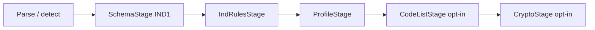

# Pipeline de validación

Visión general en lenguaje llano: [overview.md](./overview.md). Orquestación en `src/pipeline/run-pipeline.ts`. Orden fijo:

```
input → detectDocumentType → detectProfile → etapas → ValidationResult
```



## SchemaStage (siempre)

- **XML:** XSD OASIS vía `xml-xsd-engine` (`validateXmlDocument`)
- **JSON:** JSON Schema model vía Ajv (`validateJsonDocument`)
- Issues con `stage: "schema"`

## IndRulesStage (siempre, solo XML)

Reglas estructurales UBL 2.1 OS sobre el texto XML:

| Regla | Código | Severidad |
|-------|--------|-----------|
| IND2 — encoding en declaración XML | `IND2_ENCODING_REQUIRED` | error |
| IND3 — UTF-8 recomendado | `IND3_ENCODING_SHOULD_UTF8` | warning |
| IND5 — sin elementos vacíos | `IND5_EMPTY_ELEMENT` | error |
| IND7 — languageID duplicado entre hermanos | `IND7_DUPLICATE_LANGUAGE_ID` | error |
| IND8 — languageID obligatorio entre hermanos Text | `IND8_MISSING_LANGUAGE_ID` | error |

No aplica a documentos JSON.

## ProfileStage (auto, solo XML)

Se ejecuta cuando `resolveProfileId()` devuelve un ID distinto de OASIS (p. ej. `dian-fe-1.9`).

1. Resuelve perfil en `schemas/profiles/registry.json`
2. Comprueba compatibilidad `documentType`
3. Verifica existencia de XSD de extensión (**no valida aún el XML contra ese XSD**)
4. Ejecuta Schematron `.sch` con evaluador ligero

Override `{ profile: "none" }` omite esta etapa por completo.

Para JSON con perfil detectado ≠ OASIS: warning `PROFILE_JSON` y etapa marcada válida (Schematron es solo XML).

## CodeListStage (opt-in)

`{ codelist: true }` — stub. Emite warning `CODELIST_STUB` o `CODELIST_SKIPPED`. Ver [roadmap.md](./roadmap.md).

## CryptoStage (opt-in)

`{ crypto: true }` — verificación limitada de CUFE / presencia de firmas. Ver [roadmap.md](./roadmap.md).

## failFast

Con `{ failFast: true }`, el pipeline retorna tras la primera etapa con errores (schema → ind → profile).

## Agregación

- `valid === false` si `errors.length > 0`
- `warnings` no invalidan por sí solas
- `stages.*.valid` resume cada etapa ejecutada

## Meta de perfil

Siempre se calcula `meta.profileDetected` aunque `{ profile: "none" }` (información; no implica que se ejecutó ProfileStage).
